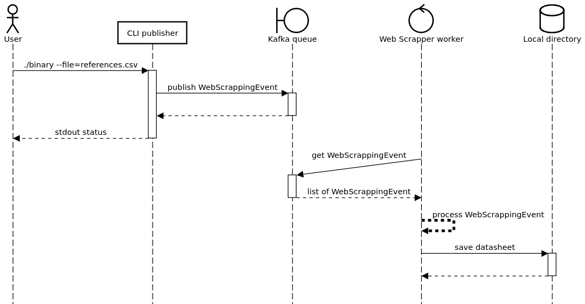

# Event-driven LCSC web scrapper

## How to build

```
make build
```

## How to run

```sh
# First terminal - Start up the Kafka and Zookeeper
sudo docker-compose up

# Second terminal
# previously prepare a CSV file with the code references to be searched
./api --file=references.csv

# Third terminal
./worker
```

## How it works



